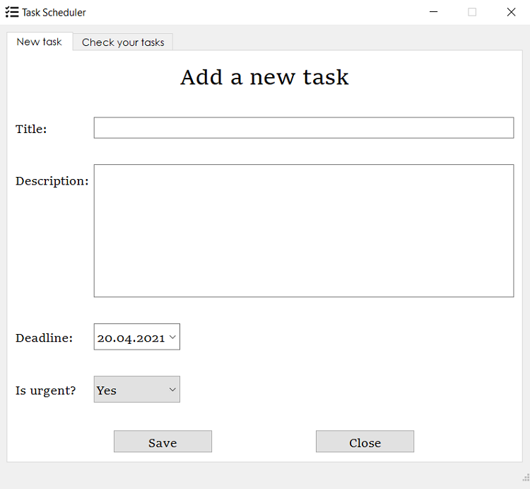
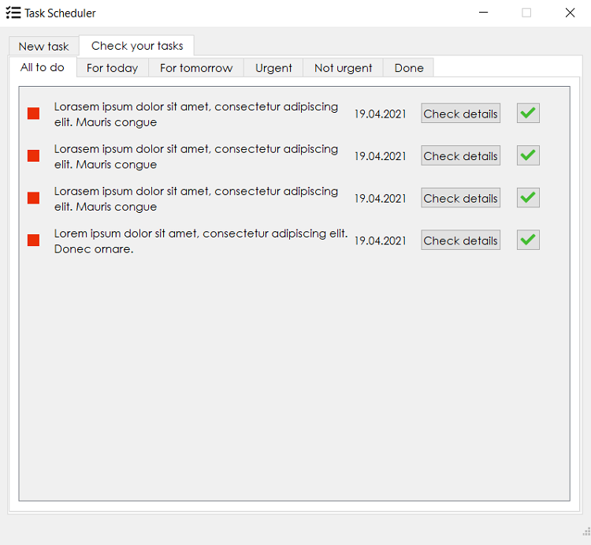
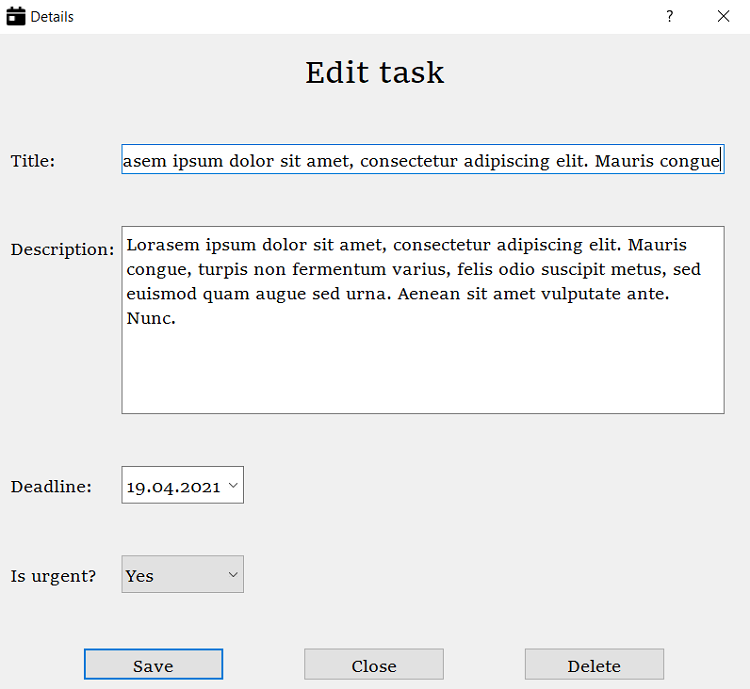
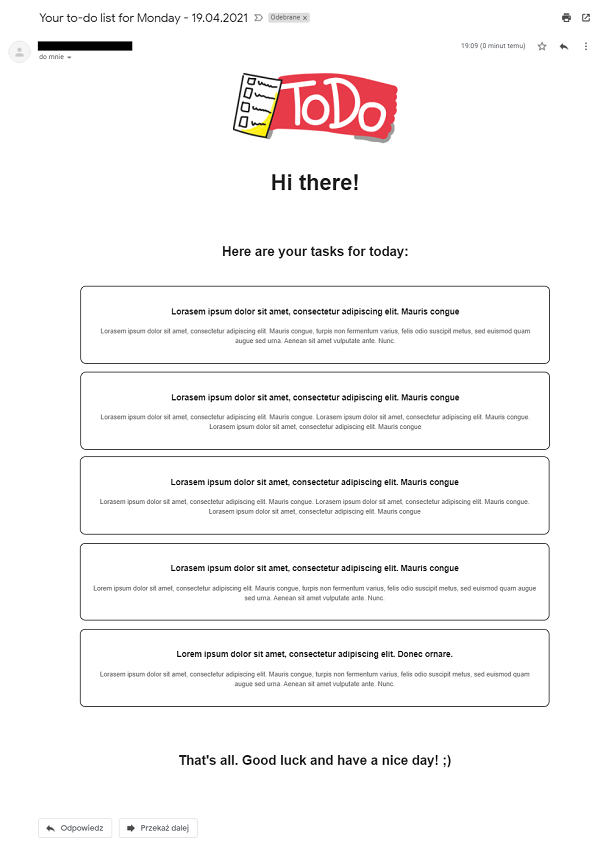

# Task Scheduler
## Description
It's your own task organizer. If you are a busy person and you want to make better use of your time, this is a desktop app for you. In Task Scheduler you can add new tasks with descriptions and deadlines and then save it to database. At any moment you have access to your assignments, you can manage them and better plan your day. When you turn on your computer in the morning, all you have to do is to check your email box and read today's to-do list which was sent by script. Easy and convenient.

## Quick Guide

To use the user interface and manage your tasks, you just have to download all the files without `emailsender` directory. `Task Scheduler.py` is the main app, so run it if you want to get to the user interface.

## If u want to use email sender feature

To get emails with today's to-do list you have to download `emailsender` directory. Then follow these steps:

1. You need to have Gmail Account.
2. You need to allow "less secure apps" in your Gmail account. Here is the link to do that: [https://myaccount.google.com/lesssecureapps](https://myaccount.google.com/lesssecureapps)
3. Then you have to create a new app in your account: [https://myaccount.google.com/apppasswords](https://myaccount.google.com/apppasswords)
4. When you get your app password then in directory `/emailsender/` you should create `.env` file with content similiar to this example:

`EMAIL_ADDRESS = 'your email address goes here'`

`EMAIL_PASSWORD = 'your app password goes here'`

5. To get an email with today's to-do list you have to run `Sender.py`.

## In the next updates
I currently work on simplifying the process of setting up the `email sender` feature. Its settings will be available from the user interface window. In settings window you'll be able to enter your email address, turn on sending emails everyday and my app will do the rest for you. That's why `If u want to use email sender feature` section is temporary. Also full application will be able as `.exe` file. Then I will add a feature of running the view of adding a new task with keybind. I'm working on it, so new update coming soon... 

## Preview screenshots

### How UI looks like?

### How automatically generated email looks like?

It's a desktop version of email, but it's responsive and on mobile phone looks even better.

